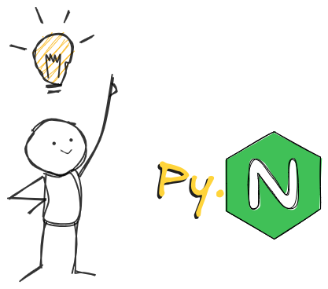
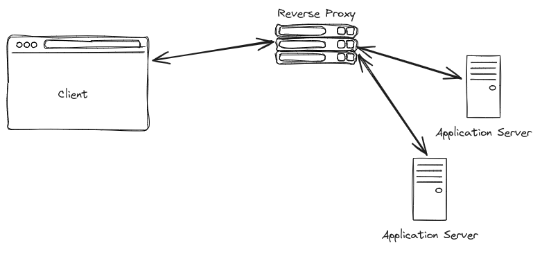

# Let's do the sin: Creating a reverse proxy in Python :)
<br><br>
<center>

</center>

<br><br>

**NB: Python is surely a wonderful language. For this reason, it can be used to solve many problems that it's not specifically designed for. This is one such problem.**


Reverse proxies are cool. Recently (relative to June 24, 2024), I built a simple web proxy that supports HTTP and WebSocket (WS) as part of my hobby project, and it was done in Python.

For better or worse, one can implement a reverse proxy in Python quite easily. However, if you ever need to write your own reverse proxy for a realistic use case, you should probably consider other platforms.

That being said, let's write a reverse proxy in Python to handle HTTP and WS traffic.

## Well, what's a reverse proxy?

Quoting [wikipedia](https://en.wikipedia.org/wiki/Reverse_proxy) *"In computer networks, a reverse proxy or surrogate server is a proxy server that appears to any client to be an ordinary web server, but in reality merely acts as an intermediary that forwards the client's requests to one or more ordinary web servers.[1][2] Reverse proxies help increase scalability, performance, resilience, and security"*

Simply, it acts as an intermediary between the client and your actual web server. By extending its functionality, one can use it to manage multiple servers under the same domain, handle authentication, manage application access, and many more. `Nginx` is good example.

<center></center>

Basically that's it. Let's jump to the code

## Building the Python proxy
### 1. Requirements

1. As a web proxy, we should first be able to receive network requests from the client (only then can we route them to a different server of choice). To handle that part, we require a web server—specifically, an `ASGI` web server, as we are going to build the proxy in Python. Essentially, a web server will help us easily bind to a system port and listen for HTTP/WS requests.
I am going with `uvicorn` for this example. Feel free to choose any other `ASGI` server of your choice, BTW, `hypercorn` is a good alternative. (One can also choose a `WSGI` server as well, though it may lack some features and require changes in the code).

2. The second step is to hand over the request data from the client to the target application server and pass the application's response back to the client. Let me pick the `aiohttp` module for this. It can be used as an HTTP/WS client to pass the data from our client to the target server via HTTP/WS.

3. And we need a python interpreter :)

**NB**: For extended features one can go for a ASGI based web framework for python like, Quart, Starlette or FastAPI (quite dense though). For this example, lets go raw.

If we got python and `pip` dependency manager in hand, the requirements can be installed using
```sh
pip3 install uvicorn aiohttp
```

### 2. Code
Let me begin with some configurable constants; I think that will make the goal clearer. Our main objective will be to replicate the proxy passing setup of Nginx. Along the way, one can add some additional header parameters or perform any other manipulations as needed

For testing purposes, let me take some example endpoints from [hoppscotch](https://hoppscotch.io/). (For those who don't know, hoppscotch is a great platform for web API developers and a modern alternative to Postman.) To start, let's route all API calls that come to our proxy server with path /http to 'https://echo.hoppscotch.io' and those with /ws to an example WebSocket endpoint, 'wss://echo-websocket.hoppscotch.io'. Of course, you can change these endpoints as needed

Lets express the above described configuration as follows,
```py
ROUTE_TABLE = {
    "/ws" : {
        "proxy_pass": "wss://echo-websocket.hoppscotch.io",
    },
    "/http" : {
        "proxy_pass": "https://echo.hoppscotch.io",
    }
}
```

Now we can focus on creating the ASGI app. If you are not familiar with [ASGI](https://asgi.readthedocs.io/en/latest/) standards, one can create a simple HTTP server serving a simple 200 response with the `app` function shown below.
```py
"""A sample ASGI based HTTP server"""
from typing import Coroutine

async def app(scope:dict, receive:Coroutine, send:callable):
    """an example ASGI app"""
    print(f"got a '{scope['method']}' call to '{scope['path']}'")
    # sending the response back
    await send({
        "type": "http.response.start",
        "status": 200,
        "headers": [
            (b"Content-Type", b"text/plain"),
        ],
    })
    await send({
        "type": "http.response.body",
        "body": b'got your call',
    })

if __name__ == "__main__":
    import uvicorn
    uvicorn.run(app, host="localhost", port=8001)
```

Enough explanations, lets code the proxy!

So the `app` module for our proxy server should be something like this,

```py

async def app(scope, receive, send):
    """The ASGI app"""
    if scope["path"] not in ROUTE_TABLE:
        ...
        # return 404 error message

    if scope["type"] == "http":
        ...
        # handle http proxying

    elif scope["type"] == "websocket":
        ...
        # handle ws proxying
```

Now let's create a simple error handler to send back a status code and some simple plain-text response back to the client, if anything goes wrong
```py
async def send_error_resp(send, status_code:int=400, msg:str="Something Went Wrong"):
    """send error response back to the client"""
    await send({
        "type": "http.response.start",
        "status": status_code,
        "headers": [
            (b"Content-Type", b"text/plain"),
        ],
    })
    await send({
        "type": "http.response.body",
        "body": msg.encode("utf-8"),
    })
```
#### Proxying the HTTP Requests

This part can be a bit tricky. One can simply write an application to buffer data from the client to the proxy and then send all the data to the target server. Afterwards, wait for the response and send it back to our client system.

This approach may result in increased latency and cause a larger memory footprint on the proxy server. Also, make sure not to use synchronous/blocking I/O operations in our proxy code, as they may affect the concurrency of the application.

In an ideal scenario, after verifying the header bytes, we should be able to stream the request body to the target application and stream the response back to the client asynchronously.

The code shown below accomplishes this task,

```py
import aiohttp

async def proxy_http(
    scope: dict,
    receive,
    send,
    target_server_props: dict,
) -> None:
    """Proxy http request to target server
    """

    # create an async generator to yield the client request chunks
    async def _generate_request_body() -> iter:
        while True:
            message = await receive()
            if message["type"] == "http.request":
                body = message.get("body", b"")
                if body:
                    yield body
                if not message.get("more_body", False):
                    break

    # creating an asynchronous http client session
    connector = aiohttp.TCPConnector(ssl=False)
    async with aiohttp.ClientSession(connector=connector, timeout=aiohttp.ClientTimeout(total=60)) as client:
        method = scope["method"]
        headers = {                 # formatting the headers
            key.decode('utf-8'): value.decode('utf-8') for key, value in scope["headers"]
            if key.lower() not in [b'host', ]   # (optionally) removing the host headers to avoid validation errors in the target server
        }

        # passing request header and stream the body to target server
        async with client.request(
            method,
            target_server_props["proxy_pass"],
            headers=headers,
            data=_generate_request_body(),
        ) as proxied_resp:
            # prepare response headers
            response_headers = [        # formatting response headers from target server
                (key.encode('utf-8'), value.encode('utf-8'))
                    for key, value in proxied_resp.headers.items()
            ]
            # send back response headers from target server to the client
            await send(
                {
                    "type": "http.response.start",
                    "status": proxied_resp.status,
                    "headers": response_headers,
                }
            )
            # sending response body to the client
            async for chunk, end_of_http_chunk in proxied_resp.content.iter_chunks():
                await send(
                    {"type": "http.response.body", "body": chunk, "more_body": True}
                )
                if end_of_http_chunk:
                    await send({
                            "type": "http.response.body",
                            "body": b"",
                            "more_body": False,
                    })

```

#### Proxying WS connection

In a similar fashion, we can proxy WebSocket (WS) requests to the target server. Unlike HTTP requests, here we may need to manage full-duplex communication.

```py
import aiohttp

async def proxy_ws(
    scope: dict,
    receive,
    send,
    target_server_props: dict,
):
    """Proxy websocket request to target server
    """
    # creating a client session
    async with aiohttp.ClientSession() as session:
        try:
            # connecting to the target server
            async with session.ws_connect(
                target_server_props["proxy_pass"], timeout=10
            ) as websocket:

                async def forward_to_backend():
                    """Forward message from client to target server!"""
                    while True:
                        message = await receive()
                        if message["type"] == "websocket.connect":
                            # inform request acceptance to the client
                            await send({"type": "websocket.accept"})
                        if message["type"] == "websocket.receive":
                            # forward messages to target server
                            data = message.get("text", message.get("bytes"))
                            if data is None: raise Exception("Empty message!")
                            if isinstance(data, bytes):
                                await websocket.send_bytes(data)
                            else:
                                await websocket.send_str(data)
                        elif message["type"] == "websocket.disconnect":
                            raise Exception("Client Disconnect!")
                        elif message["type"] == "websocket.close":
                            await websocket.close(code=message.get("code", 1006))
                            raise Exception("Client Close Req!")

                async def forward_to_client():
                    """Forward messages from target server to client"""
                    async for message in websocket:
                        # forward messages to client
                        if message.type == aiohttp.WSMsgType.TEXT:
                            await send({"type": "websocket.send", "text": message.data})
                        elif message.type == aiohttp.WSMsgType.BINARY:
                            await send({"type": "websocket.send", "bytes": message.data})
                        # disconnect events
                        elif message.type == aiohttp.WSMsgType.CLOSE:
                            raise Exception("Server Close Req!")

                        elif message.type == aiohttp.WSMsgType.ERROR:
                            raise Exception(f"Server Error! {message.data}")
                    raise Exception(
                        f"closing session - {websocket.close_code}"
                    )

                try:
                    # forward messages in both directions in parallel (asynchronously)
                    await asyncio.gather(forward_to_backend(), forward_to_client())
                finally:
                    # connection garbage collection
                    await websocket.close()
                    try: await send({
                        "type": "websocket.close",
                        "code": websocket.close_code or 1006,
                    })
                    except: pass

        except Exception as e:
            # close the client connection if the target server is not responding
            try: await send({
                "type": "websocket.close",
                "code": 1014,
                "reason": "Server Not Responding!",
            })
            except: pass

```

#### The updated ASGI module

Combining the `proxy_ws`, `proxy_http` and `send_error_resp` we can rewrite the asgi application module as bellow,
```py

async def app(scope, receive, send):
    """The ASGI app"""
    if scope["path"] not in ROUTE_TABLE:
        return await send_error_resp(send, 404, "Not Found")

    if scope["type"] == "http":
        # handle http proxying
        try: return await proxy_http(scope, receive, send, ROUTE_TABLE[scope['path']])
        except: return await send_error_resp(send, 502, "Bad Gateway")

    elif scope["type"] == "websocket":
        # handle ws proxying
        try: return await proxy_ws(scope, receive, send, ROUTE_TABLE[scope['path']])
        except: return await send_error_resp(send, 502, "Bad Gateway")
```

### 3. Running the proxy server

Now to serve the application we can make use of our ASGI server. After saving the code into a file say, `main.py` which contains the callable `app`, we can start the proxy server with,
```sh
uvicorn main:app --host localhost --port 8000
```

## Testing

If everything went well, one will get the exact same response of both `https://echo.hoppscotch.io` and `wss://echo-websocket.hoppscotch.io` when we hit to `http://localhost:8000/http` and `ws://localhost:8000/ws` respectively.

**Tip**: `wscat` is a decent command line utility to test ws endpoints. BTW, If you are looking for a UI, [hoppscotch](https://hoppscotch.io/) is also a good option for testing http and ws. It also support other protocol standards like SSE, MQTT, SOCKET IO and GraphQL. (PS: not a paid promotion :)


**Whoop!** Enjoy using the proxy, and try not to use it for a real use case.

> PFA the complete code over [here](https://gist.github.com/bRuttaZz/a16e0b7d0c604aa7f13c1cb6efbc0cfa)
