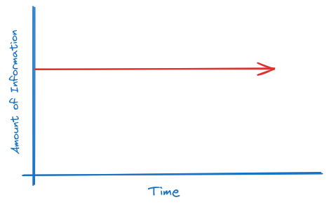
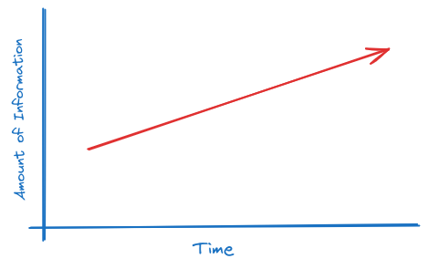

# Good thing is: Life is not a univariate function of time. Or is it?

<center>

<br>


Figure: <a href="https://www.instagram.com/viktordepictor/">Viktor Beekman</a>’s rendition of Laplace’s demon


</center>
<br>

**Is life simply a function of time?** This question had troubled me deeply for quite some time.

Let me detail; By the late 1700s, classical mechanics had grown enough that most physicists at that time believed that every secret in physics had almost been figured out, and only some detailed explanations were left for some physical phenomena. That belief naturally led to the question: if everything in this world can be completely described using the laws of classical mechanics, can we predict the future with it?

For instance, using the laws of classical mechanics, we can determine the exact location and momentum of an atom in the next instant, provided we know the exact initial conditions. As one can see, the atmosphere, nature, the stars, and everything else is made up of such particles. This implies we can predict the fate of all of these things, assuming we know the initial conditions.
<br>It even applies to complex biological beings. From our hunger and appetite to our emotions and deeds, and even the next word I'm going to type on my computer, everything can be described as an aftereffect of previous events from the surroundings, hormonal states, neural activity, etc. (As there is no strong evidence of God, let's ignore that for now).

In general, we could predict the whole universe if we were able to know the initial conditions or state of the entirety. The French scholar [Pierre-Simon Laplace](https://en.wikipedia.org/wiki/Pierre-Simon_Laplace) was the first to popularize this idea. He said that if there is a being (let me call it a demon) that knows the complete state of the universe, including the exact momentum and position of every molecule, and has enough computational ability to process this information using the laws of science, it could describe the future as clearly as the past. This conceptual being is known as **Laplace's Demon**.

It was during my high school years that I stumbled upon these ideas as part of my daydreaming (I didn't know about Laplace's Demon at that time). I suddenly became really upset, wondering if everything in this world can technically be predicted, does it mean the whole world is just a function of time? No matter what we do, if we could take a snapshot of the future, everything would be the same because our actions are merely extensions of our previous state. Whether we are lazy or motivated, everything seems to be just a function of time. If we knew the initial state of the universe, the state at any particular time, our lives would only depend on one parameter: **time**. If that's the case, there is nothing in this world we can do to change our destiny.

### Really?

After a few months, we started learning **Thermodynamics**, which was a delight for me, as it helped me find some satisfying answers to this quest. Trust me it's fun..

Suppose, Laplace's Demon is true, then the graph showing the amount of information versus time for the universe will look like the one shown bellow,

<center>
    
</center>

i.e., from the existing state of the universe and a set of equations and formulas, the demon can predict the future. Therefore, no new information is added, meaning the curve should run parallel to the time axis.

Wait, what does 'information' mean here? Well, it can be defined as the facts/data regarding something. In other terms, information can be understood as a measure of how random an object is.


For example, let's take a sentence, say `I love you`. If we disregard grammar, we can compress this sentence to `I lv u`. I could convey the same message to my imaginary girlfriend with this shortened version, if my intention is only to transmit the information. Here, we have stripped away redundant elements from the language code, yet the information remains intact. This suggests that information can be seen as the essential data that persists when all unnecessary factors and patterns are removed from the original one. The remaining data may appear completely random, without any patterns. Therefore, one could define information of an object as a measure of its randomness 🤯. (Yes, this is a super simplified explanation of information theory. anywho, feel free to find more about it [here](https://en.wikipedia.org/wiki/Information_theory)). In physics, randomness of a system is often quantified using Entropy.
So,
```
    Information -> Randomness -> Entropy
```

The point is, if Laplace's Demon is possible, then the entropy of the universe should remain constant, as shown in the figure.

Fortunately, as implied by **[second law of thermodynamics](https://en.wikipedia.org/wiki/Second_law_of_thermodynamics)** we are not living in such a universe.
<br>In our universe, the state of entropy will keep on increasing. So the graph should resemble the one shown below.

<center>
    
</center>

Aand what does it mean??
<br>Laplace's demon is not a possible one.
<br>The universe is not solely a function of time (at least we cannot predict it with time alone).
<br>And the future cannot be predicted.


That's it! When you wake up from your bed, if you ever feel like life is boring, think about the **second law of thermodynamics**; your day will never be that predictable and boring. There will always be some random things waiting for you along the way.

<br><br><br>

> Wait a min, where does the additional information come from? Not sure, maybe from the events when quantum mechanical [wave functions collapses](https://en.wikipedia.org/wiki/Wave_function_collapse)..

> There is a problem. Even in this case, the newly emerging information is completely random, right? Still, nothing is within our control, right??

> (Leave me alone! I'm tired of these questions.)
