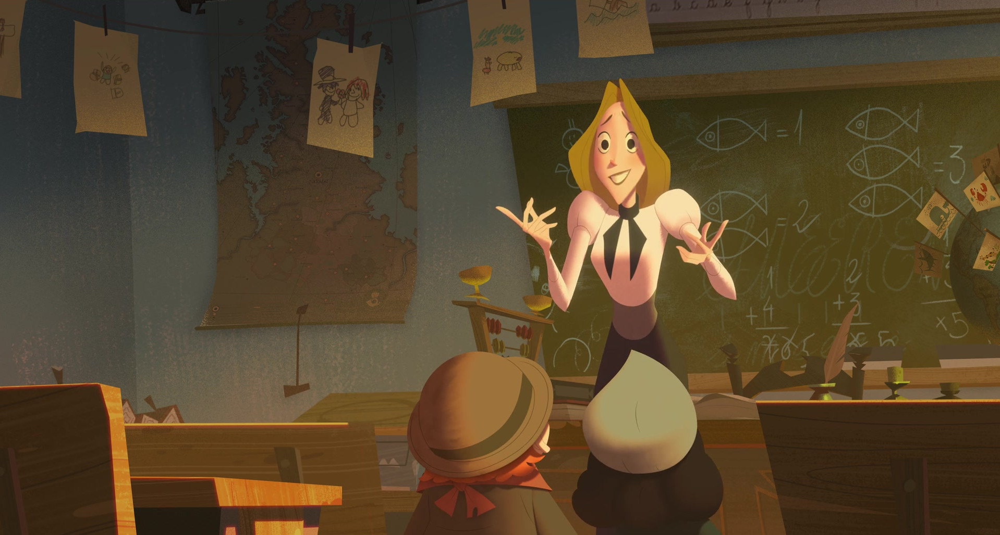

# Teachers: A Lazy Love Letter

<small>⚠️ Warning: Lazy-lawnchair-writing ahead!</small>

 

Figure: Character Alva from the movie <a href="https://www.imdb.com/title/tt4729430/">Klaus</a>.

You know what's the good thing about being a teacher is…

It's not about being the complete one: the one who knows everything her/his students might ever ask. I think it's all about being the one who can share the best of her/his knowledge with others… without any ego complexities.

So that each of their children grow apart and either use that knowledge to make their or their surroundings’ lives better, or the best part, where they push the boundaries of that knowledge and fill the missing parts. No matter whether it’s wisdom, science, or politics…

Isn't it so good that one day the student might come back to the teacher and say, “Hey! Don’t you remember when you said you didn’t know the whole answer to the question I asked? Still, you taught me everything you knew about it and asked me to share the answer if I ever found it? I found it!”

And then the teacher could gratefully say back,
“That’s so good. I am happy for you. Thanks for the knowledge. I will definitely share it with my new students and tell them our little story behind it.”

And finally, the teacher may ask that one not to forget sharing that beautiful knowledge with everyone who seeks it.
